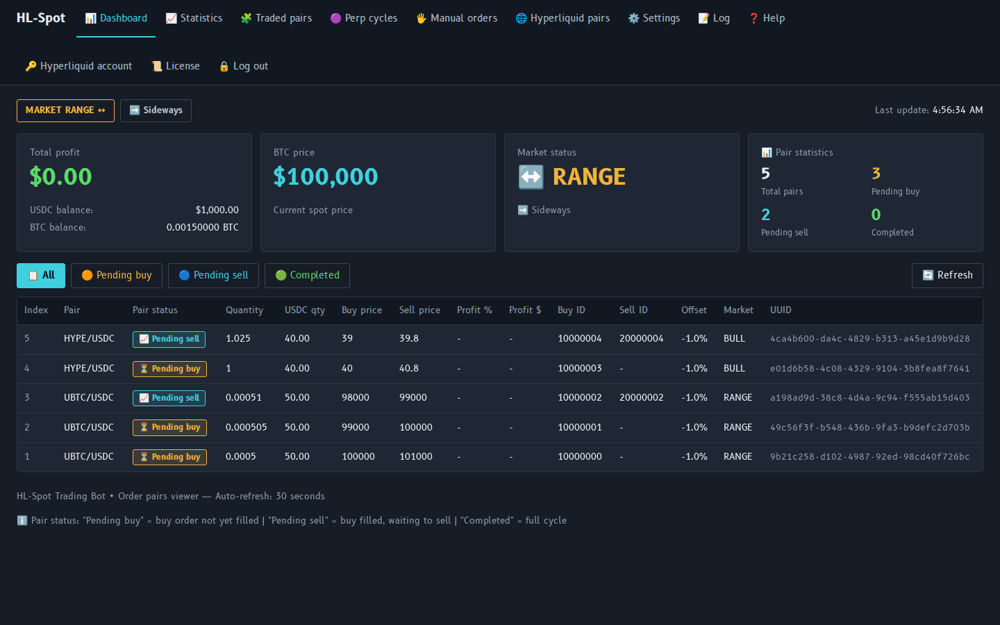
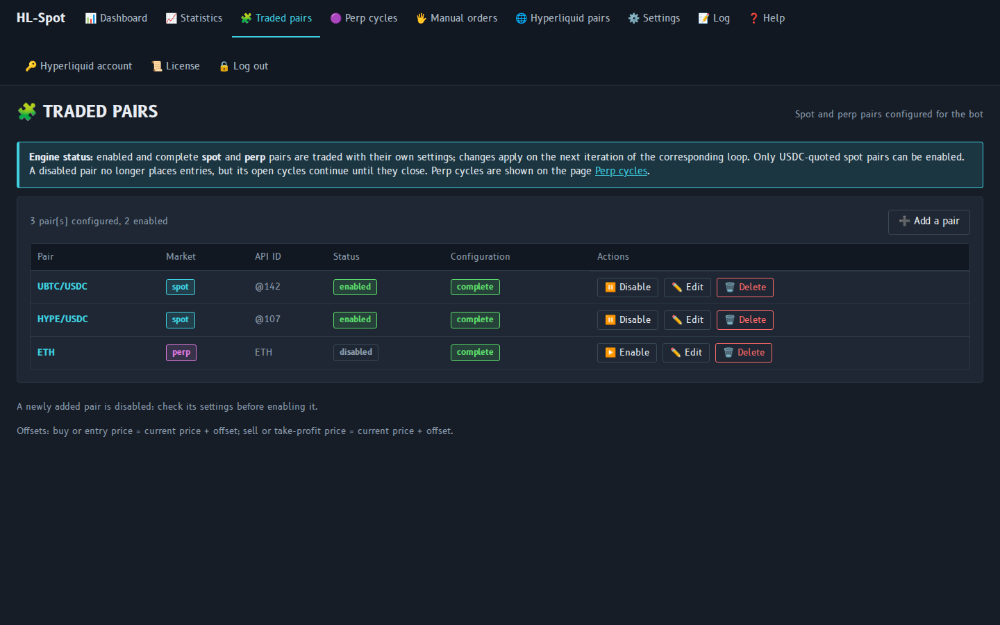
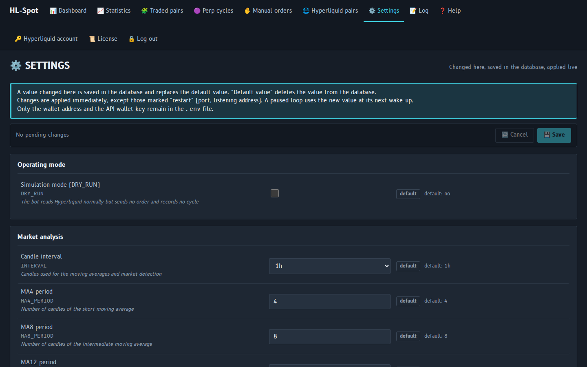
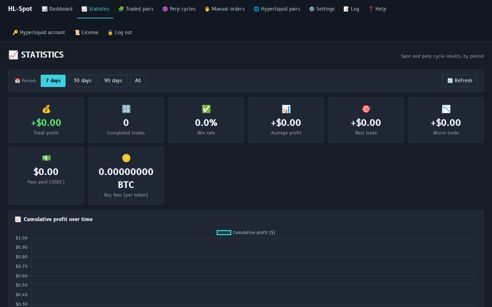
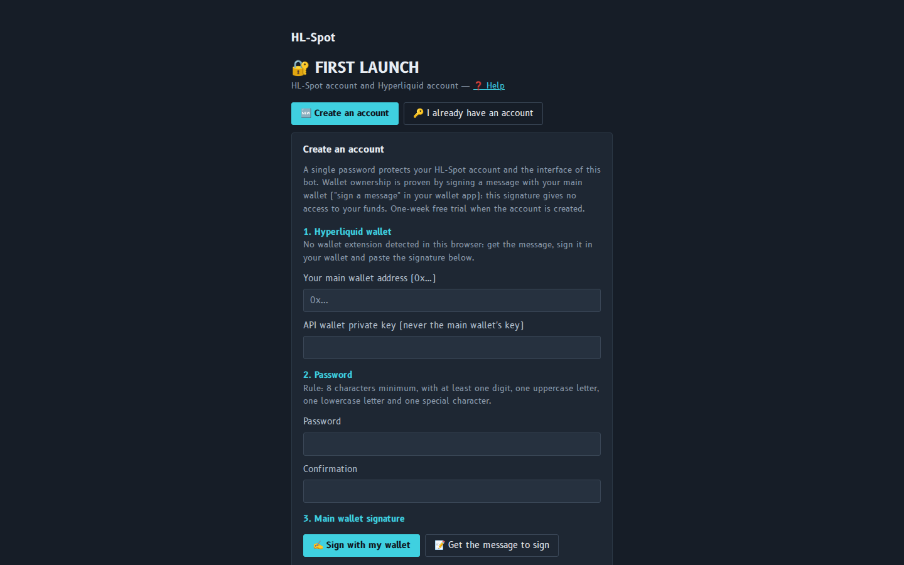
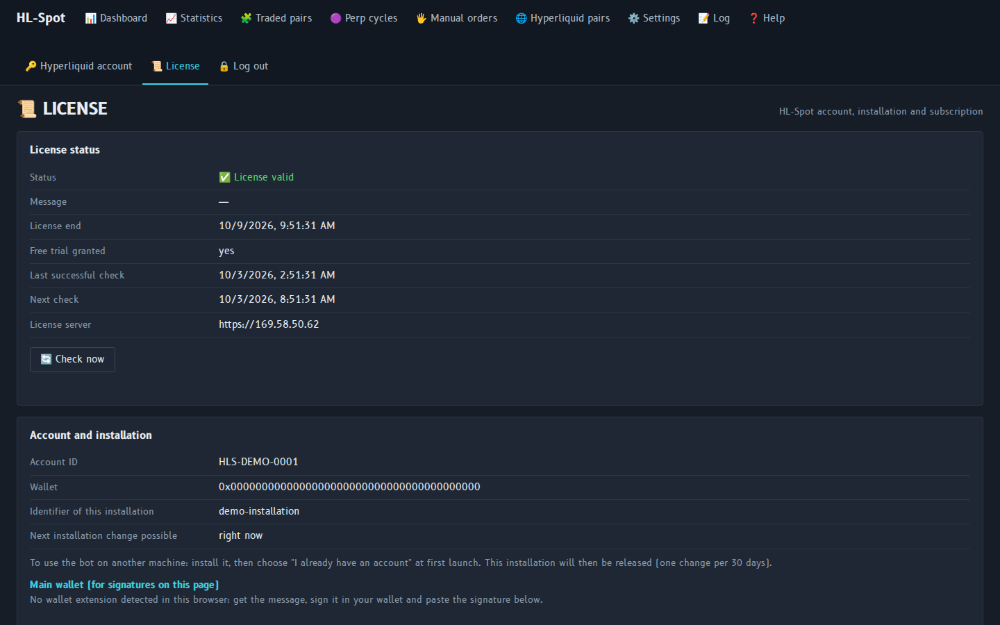
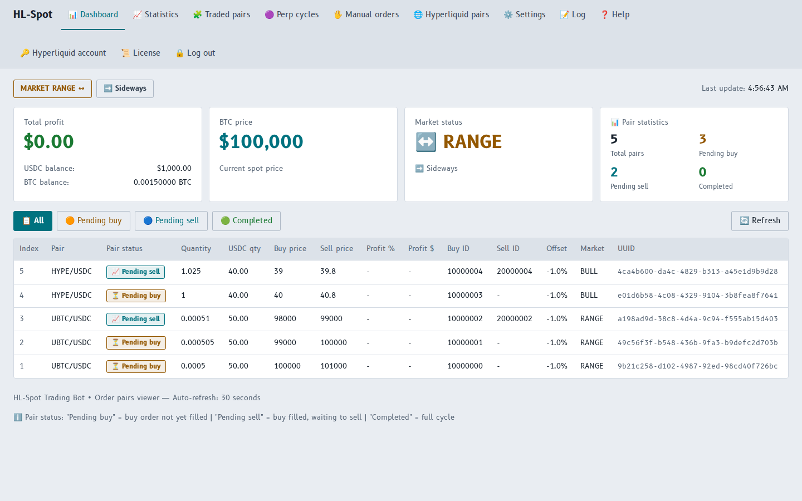

# HL-Spot

Trading bot for **Hyperliquid**: spot and perpetual (perp) markets, several pairs, automatic and
manual orders. It runs on your own computer (Windows, Linux or Docker) and you control it from
your web browser. Your API wallet key stays encrypted on your computer.

**Website: https://hlspot.com**

## Screenshots

*Demo data: the figures shown are not real results.*



| | |
|---|---|
| <br>Traded pairs | <br>Settings |
| <br>Statistics | <br>First launch |
| <br>License | <br>Dashboard, light theme |

## Download

Download the files from the [Releases](https://github.com/HL-Spot-Bot/HL-Spot-Bot/releases) page of this repository.

| File | System |
|---|---|
| `HL-Spot-1.0.2-prod-windows-x64.zip` | Windows (x86_64) |
| `HL-Spot-1.0.2-prod-linux-x64.zip` | Linux (x86_64): Ubuntu 22.04, 24.04, 26.04, Debian 12 or newer |
| `HL-Spot-1.0.2-prod-docker-x64.tar.gz` | Docker image (x86_64) |

Each file comes with a `.sha256` file to check the download.

## User guide

| Language | Online | PDF |
|---|---|---|
| English | [USER_GUIDE.en.md](docs/USER_GUIDE.en.md) | [PDF](docs/pdf/HL-Spot-User-Guide-en.pdf) |
| Français | [USER_GUIDE.fr.md](docs/USER_GUIDE.fr.md) | [PDF](docs/pdf/HL-Spot-User-Guide-fr.pdf) |
| Español | [USER_GUIDE.es.md](docs/USER_GUIDE.es.md) | [PDF](docs/pdf/HL-Spot-User-Guide-es.pdf) |
| Deutsch | [USER_GUIDE.de.md](docs/USER_GUIDE.de.md) | [PDF](docs/pdf/HL-Spot-User-Guide-de.pdf) |
| Italiano | [USER_GUIDE.it.md](docs/USER_GUIDE.it.md) | [PDF](docs/pdf/HL-Spot-User-Guide-it.pdf) |
| Português | [USER_GUIDE.pt.md](docs/USER_GUIDE.pt.md) | [PDF](docs/pdf/HL-Spot-User-Guide-pt.pdf) |
| Русский | [USER_GUIDE.ru.md](docs/USER_GUIDE.ru.md) | [PDF](docs/pdf/HL-Spot-User-Guide-ru.pdf) |
| 中文 | [USER_GUIDE.zh.md](docs/USER_GUIDE.zh.md) | [PDF](docs/pdf/HL-Spot-User-Guide-zh.pdf) |

The same guide is available in the bot: menu **❓ Help** (`http://localhost:60000/help`).

## Quick start

1. Create an **API wallet** on https://app.hyperliquid.xyz/API (never use the private key of
   your main wallet).
2. Install HL-Spot, then open http://localhost:60000:
   - **Windows**: unzip, then run `HL-Spot.exe` (keep its console window open);
   - **Linux**: unzip, then run `./hl-spot` from the unzipped folder;
   - **Docker**:
     ```
     docker load -i HL-Spot-1.0.2-prod-docker-x64.tar.gz
     docker run -d --name hl-spot --restart unless-stopped -p 60000:60000 \
            -e TZ=Europe/Paris -v hl-spot-data:/data hl-spot:1.0.2
     ```
   - **Flux** (decentralized cloud): image `olivier1246/hl-spot:1.0.2` — read section 16 of the
     user guide first (API wallet key security, required settings).
3. **First launch**: create your account (7-day free trial).

## Subscription

7 days: 2 $ · 30 days: 6 $ — paid in crypto from the License page of the bot. Read the payment
rules in the user guide (section 7) before paying.

## Support

E-mail: HL-spot@cmails.eu

## License

Proprietary — see `license.txt` in the download.
